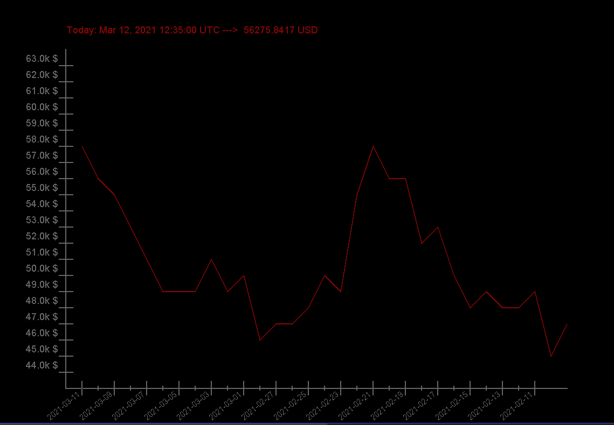

# BitcoinPriceTracker

Simple program, which get information from free API about bitcoin price. Shows bitcoin price on this moment and get history prices during one month ago
Making graphic of history prices.
Used JSONsimple library and standart Java AWT,SWING libraries.

